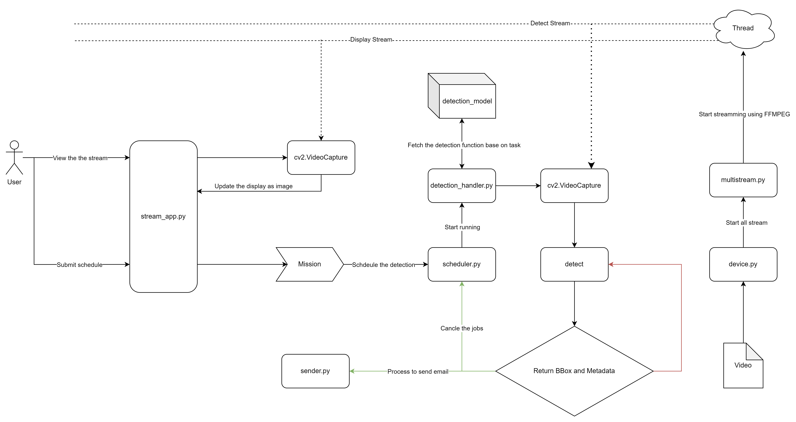

# Computer Vision For Parking Application

## 1. Introduction

This document outlines the system pipeline for our computer vision application. The pipeline describes the data flow and processes from input to output, detailing each component and its function within the system.

## 2. Pipeline Overview

Our computer vision pipeline consists of the following main stages:

- Initialize streaming device
- Initialize application
- Submitting Jobs
- Detection
- Sending Email



## 3. Detailed Pipeline Stages


### 3.1 Initialize Streaming Device

In this project, we will create some thing like real camera which will have streaming. So we will mimic that from video using FFMPEG, which creates a real-time camera with an RTSP link to read that stream. To simplify the setup process, the stream ( which should be using TCP ) will be converted into a UDP format, suitable for use in a Windows environment ( who not know docker ). This functionality will be handled in `device.py`. 
For every video we will create 2 stream, one for detection task, another is for showing on the app. This is because we cannot use 2 reader from the same stream.

### 3.2 Initialize Application

After setting up the streaming device, we need a frontend application to read the stream using `CV2` and process the video to display the time. The application is also responsible for object detection and submitting job actions. This functionality is implemented in `app/stream_app.py`.


### 3.3 Submitting Jobs

From the application tier, users can submit jobs to schedule detection at a specific date and time. The pre-processing logic will be handled in `app/stream_app.py`, which will pass data into a job manager located in `detection/scheduler.py`. This module will manage the jobs and call the detection process when it's time to execute. Jobs here is an task that will be run in spercific time from x to y. During this time, if there is a detection match the requirement, it will stop the jobs. Otherwise, it will automaticly stop when meet the end time.

### 3.4 Detection

The detection process is implemented in `detection/detection_handler.py`, which determines which detection method (vehicle or human or loitering, ect) to use and draws bounding boxes after obtaining bounding box coordinates and metadata. 

To add more detection methods, ensure the new file is named `{detection_name}_detection.py`, update the `detection_mapping` inside `app/stream_app.py`, and ensure the output format is as follows:
```
# Define a dictionary for detection type mapping
detection_mapping = {
    "Detect People": "human",
    "Detect Vehicle": "car",
    "Detect Loitering People":"loitering_people",
    "Detect Loitering Vehicle": "loitering_vehicle"
}
```


#### Example of bounding boxes and metadata
```
bounding_boxes = [
    [x1, y1, x2, y2],  # For example: [100, 50, 200, 150]
]

metadata = [
    {"label": "Person", "confidence": 0.95},
]
```
### 3.5 Sending Email

Once detection is complete, an email will be sent to the end user with the detection results. The application will use the first frame (picture) from the stream, process it for detection, and notify users.

## 4. Setup Instructions

To run the project we need to follow these steps:
1. Create a folder named `model` in the root directory.
2. Add the `yolov8m.pt` file into the `model` folder. ( optional, python will automaticly install yolov8m.pt to your directory )
3. Create the `.env` file to the root and add EMAIL_APP_ACCOUNT and EMAIL_APP_PASSWORD which the account will be email_address you used to send that and the password could be taken by follow this
https://www.youtube.com/watch?v=74QQfPrk4vE  

4. Install all required libraries by running:
   `pip install -r requirements.txt`

5. Install the FFMPEG and configure the path for it.  https://www.youtube.com/watch?v=4jx2_j5Seew . Make sure you restart your computer after configure like the video.
6. Run `device.py` to start the stream and press 1 + Enter to start the stream. 
7. Finally, run `main.py` to start the application and enjoy!

### Note:
There is a known bug with the stream selection which cv2 fail to catch the stream due to the unstabeness of it. If the stream does not pop up after selection for a bit of time, try selecting a different stream or re-select it  to make it work.
Right now there will be 4 module could be use for detection

## 5. Troubleshooting

- If you encounter issues with streaming:
  - Ensure that the FFMPEG installation is properly configured.
  - Check the UDP URL and make sure it is correctly formatted.
  - There is unit test for all of the component which will help you to undertand what does it do.

- For detection errors:
  - Verify that the model file (`yolov8m.pt`) is correctly placed in the `model` directory.
  - Ensure all required libraries are installed.
